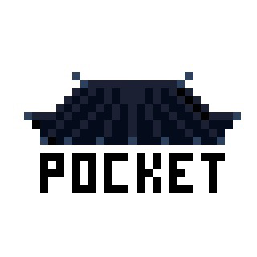

<!-- PROJECT LOGO -->
<br />
<div align="center">
  <a href="https://github.com/padosum/pocket-kyujanggak">
    
  </a>
  <h3 align="center">포켓 규장각</h3>
</div>

<!-- ABOUT THE PROJECT -->
## About The Project

👀 [포켓 규장각](https://pk.padosum.dev)

영도 도서관의 도서 소장 여부와 대출 상태를 조회할 수 있는 앱입니다.
다음 기능을 갖췄습니다:
- 검색어를 이용해 도서 목록 조회
- 원하는 도서 북마크 기능 (localStorage)
- SPA
- Pagination


### Built With

* [Vite.js](https://vitejs.dev/)


<!-- GETTING STARTED -->
## Getting Started
```sh
git clone git@github.com:padosum/pocket-kyujanggak.git
cd pocket-kyujanggak
npm i
npm run dev
```

### 환경 변수 설정 
1. [kakao developers](https://developers.kakao.com/)에서 [Daum 검색 - 책 검색 API KEY](https://developers.kakao.com/docs/latest/ko/daum-search/dev-guide#search-book) 발급
2. [도서관 정보나루](https://www.data4library.kr/)에서 API KEY 발급 
3. 프로젝트 루트에 `.env` 파일 생성후 API KEY 입력
   ```
   VITE_KAKAO_API_KEY=KAKAO API KEY 입력
   VITE_LIBRARY_API_KEY=정보나루 API KEY 입력
   ```
- 🚨 [도서관 정보나루 API](https://www.data4library.kr/): API 요청 일일 500건 제한

### 도서관 정보 변경
[도서관 정보나루 API 메뉴얼 참고](https://www.data4library.kr/apiUtilization), 
src/api/index.js `libCode` 값을 해당 도서관으로 수정
```js
const BookApi = {
  async getBookStatus(isbn13) {
    const authKey = import.meta.env.VITE_LIBRARY_API_KEY
    const libCode = '121014'
    // ...
}
```

<!-- ROADMAP -->
## Roadmap

- [ ] 다른 도서관도 조회하기
- [ ] React


<!-- ACKNOWLEDGMENTS -->
## Acknowledgments

* [kakao developers 검색 API](https://developers.kakao.com/)
* [도서관 정보나루 API](https://www.data4library.kr/)
* [Font Awesome](https://fontawesome.com)
* [Icons8](https://icons8.kr/icon/j1UxMbqzPi7n/%EC%9D%B4%EB%AF%B8%EC%A7%80-%EC%97%86%EC%9D%8C)
* [skeleton-screen-css](https://github.com/nullilac/skeleton-screen-css)
* [Image Lazy Loading](https://helloinyong.tistory.com/297)
* [gatsby-theme-element](https://gatsby-theme-element-jm.netlify.app/)
* [Vectornator](https://www.vectornator.io/)
* [Vercel](https://vercel.com)
* [Front-End-Checklist](https://github.com/thedaviddias/Front-End-Checklist)
* [dropdown button](https://codepen.io/raneio/pen/NbbZEM)
* [LOADING.IO](https://loading.io/css/)
* [Best README Templates](https://github.com/othneildrew/Best-README-Template)